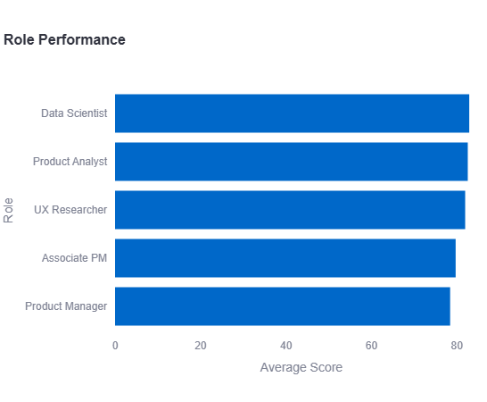
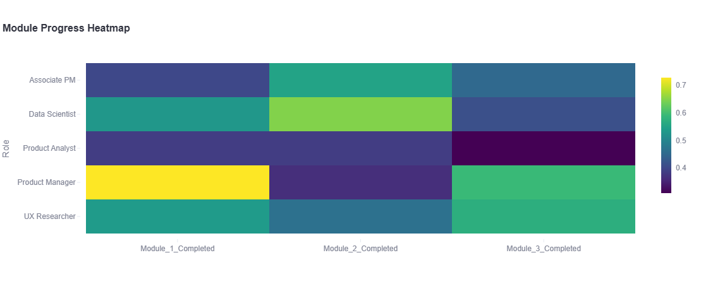
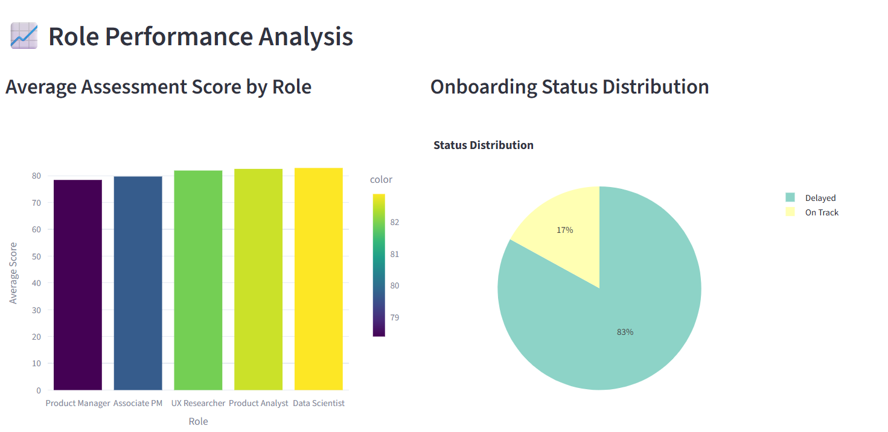
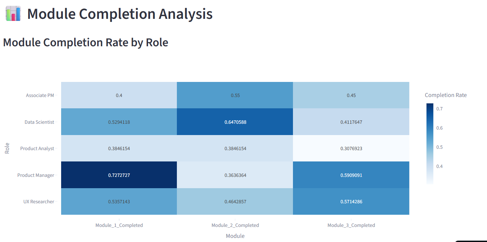
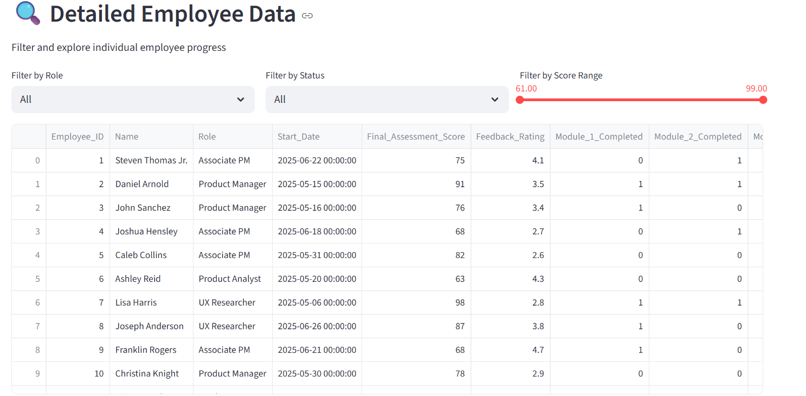

# Onboarding Dashboard 📊

This project provides an interactive dashboard for analyzing employee onboarding data using Streamlit and Plotly.

## Features

### Key Metrics and Insights 📈

- **Overview Statistics:** Total employees, completion rates, and average assessment scores
- **Status Tracking:** Real-time monitoring of "On Track" vs "Delayed" employees
- **Performance Analytics:** Detailed assessment score analysis by role

### Interactive Visualizations 📊

- **Role Performance:** Dynamic bar charts showing assessment scores by role
- **Status Distribution:** Interactive pie charts for onboarding status
- **Module Progress:** Heat maps showing completion rates across roles
- **Filtered Views:** Custom filters for role, status, and score ranges

### Data Management 🔍

- **Data Cleaning:** Automated preprocessing of onboarding data
- **Status Calculation:** Smart tracking based on module completion and start date
- **Modular Design:** Separated logic for better maintenance and scalability

## File Structure

- `onboarding_dataset.csv` — The onboarding data.
- `data_cleaning.py` — Data loading and cleaning functions.
- `status_logic.py` — Onboarding status calculation.
- `analysis.py` — Analysis and aggregation functions.
- `dashboard.py` — Streamlit dashboard app.

## Setup

1. **Install dependencies:**

   ```powershell
   pip install streamlit plotly pandas
   ```

2. **Run the dashboard:**

   ```powershell
   streamlit run dashboard.py
   ```

3. **View in browser:**

[Launch Onboarding Dashboard](https://harshith1118-onboard-dashboard-gzhq7b.streamlit.app/)

**Screenshots:**












## Usage

- Explore onboarding trends and employee status.
- Filter and sort data interactively.
- Visualize module completion rates and assessment scores.

## Customization

- Update `onboarding_dataset.csv` with your own data.
- Modify analysis or visualization logic in the respective Python files.

---
